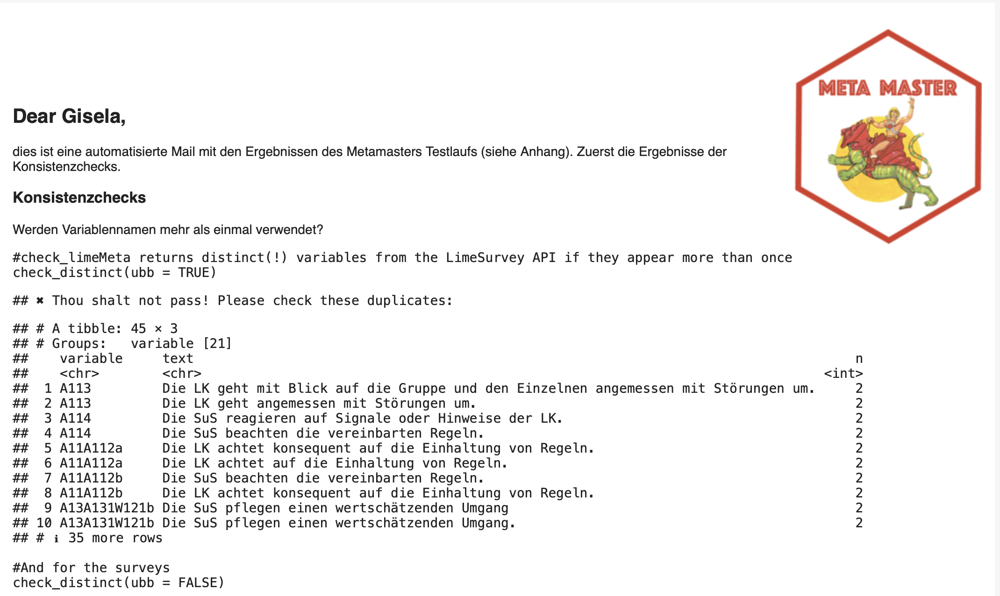

```{r, include = FALSE}
knitr::opts_chunk$set(
  collapse = TRUE,
  eval = FALSE,
  comment = "#>"
)

library(MetaMaster)
# Sys.setenv(R_CONFIG_ACTIVE = "test")
```

The MetaMaster package creates the *master meta data*. The latter are meta data for Lime Survey which are reproducible, tested, and - in consequence - error-free. To this end, the package provides functions to exchange data via the Lime Survey API (`LS_*`) and to work with a PostgreSQL (`DB_*`) database. Furthermore, the package introduces consistency checks and further helpers to automate the process to build meta data for Lime Survey.

In order to use the package, you must provide credentials and other parameters to get access to the Lime Survey API (e.g., user name). The MetaMaster packages relies on the `config` package and all necessary parameters need to be available in the `config.yml` file in the working directory [@config]. The next console shows an example.

``` yaml
default:
  tmp.server: "Name"
  api_url: "URL"
  tmp.user: "user"
  tmp.credential: "Password"
  
test:
  tmp.server: "Name"
  api_url: "URL"
  tmp.user: "user"
  tmp.credential: "Password"
```

In case there is no config file yet, create a new one with the `create_config()` function which has all default parameters included. Furthermore, the config package picks the *default* parameters without any adjustments. To use the configuration for a different environment (e.g., `test`), update the environmental variable `R_CONFIG_ACTIVE`. The master templates of the OES live in the `test` environment which is why we set it accordingly to build the meta data.

```{r}
#Set the R_CONFIG_ACTIVE
library(MetaMaster)
Sys.setenv(R_CONFIG_ACTIVE = "test")
```

 

## MetaMaster in Action

Let's build the master meta data: (1) We download the raw data via the Lime Survey API. (2) We build the master meta data based on the raw data. (3) We run consistency checks and inspect the results in an email report. (4) We update the results to the database. The `build()` function runs these steps in sequence:

```{r}
build(send_report = TRUE, update = TRUE)

# ℹ Starting the build process...
# ℹ Fetching raw meta data from Lime Survey
# ✔ Raw meta data exported.                          
# ℹ Building metadata for the master data...
# ✔ MetaMaster exported.                  
# ✔ The table 'metadata_raw' has been successfully uploaded to the database.
# ℹ Sending the report...
# The email message was sent successfully.                       
# ✔ By the power of Grayskull: Building process completed.
```

The following console displays the `build()` function and the next section outlines what happens under the hood.

```{r, eval = TRUE}
#Build the Meta Master Data
build
```


## MetaMaster Under the Hood

In the first relevant step, the `LS_GetMasterData()` function creates the raw meta data. The function gets all master templates from the LimeSurvey API and retrieves for each master the survey question, id, so on. The function returns a tibble or exports the data if the `export` parameter is set to `TRUE`.

```{r}
#Get the survey questions for the first three master templates
LS_GetMasterData(export = TRUE)
# ✔ Master Data exported.  
```

The `LS_GetMasterData()` is a wrapper function that combines the `LS_GetMasterTemplates()` and the `LS_GetMasterQuestions()` function. Under the hood, the `LS_GetMasterTemplates()` function returns all templates from the Lime Survey API if their name start with `master_`. More precisely, it returns a tibble with the survey id, the survey title, and the template name (from the master to template file).

```{r}
LS_GetMasterTemplates(template = TRUE)
# # A tibble: 95 × 3
#    sid    surveyls_title                       template                       
#    <chr>  <chr>                                <chr>                          
#  1 197865 master_01_bfr_allg_gm_elt_00_2022_v4 tmpl_bfr_allg_gm_elt_00_2022_p1
#  2 197865 master_01_bfr_allg_gm_elt_00_2022_v4 tmpl_bfr_allg_gm_elt_00_2022_p3
#  3 197865 master_01_bfr_allg_gm_elt_00_2022_v4 tmpl_bfr_allg_rs_elt_00_2022_p1
#  4 197865 master_01_bfr_allg_gm_elt_00_2022_v4 tmpl_bfr_beru_ws_elt_00_2022_p1
#  5 943467 master_02_bfr_allg_gm_elt_01_2022_v4 tmpl_bfr_allg_gm_elt_01_2022_p2
#  6 943467 master_02_bfr_allg_gm_elt_01_2022_v4 tmpl_bfr_allg_gm_elt_01_2022_p4
#  7 866667 master_03_bfr_allg_gm_leh_00_2022_v4 tmpl_bfr_allg_gm_leh_00_2022_p1
#  8 866667 master_03_bfr_allg_gm_leh_00_2022_v4 tmpl_bfr_allg_gm_leh_00_2022_p2
#  9 866667 master_03_bfr_allg_gm_leh_00_2022_v4 tmpl_bfr_allg_gm_leh_00_2022_p3
# 10 866667 master_03_bfr_allg_gm_leh_00_2022_v4 tmpl_bfr_allg_gm_leh_00_2022_p4
# # ℹ 85 more rows
# # ℹ Use `print(n = ...)` to see more rows
```

The `LS_GetMasterQuestions()` function gets the survey questions for a specific master template. The function needs the survey id and the template name as input. The function returns a tibble with the survey id, the template name, the plot, the variable, the text, and the filter indicator.

```{r}
LS_GetMasterQuestions(id = "197865", name = "master_01_bfr_allg_gm_elt_00_2022_v4")

# # A tibble: 29 × 6
#    surveyID template                             plot  variable      text              filter
#    <chr>    <chr>                                <chr> <chr>         <chr>             <chr> 
#  1 197865   master_01_bfr_allg_gm_elt_00_2022_v4 E01   B131W124EB13a An dieser Schule… FALSE 
#  2 197865   master_01_bfr_allg_gm_elt_00_2022_v4 E01   B132aB13a     Mein Sohn/meine … FALSE 
#  3 197865   master_01_bfr_allg_gm_elt_00_2022_v4 E01   B132cB13a     Die Räume der Sc… FALSE 
#  4 197865   master_01_bfr_allg_gm_elt_00_2022_v4 E01   B133bB13a     Die Schule ist e… FALSE 
#  5 197865   master_01_bfr_allg_gm_elt_00_2022_v4 E02   B334W125aB33a An dieser Schule… FALSE 
#  6 197865   master_01_bfr_allg_gm_elt_00_2022_v4 E02   B334W125bB33a Wenn es Konflikt… FALSE 
#  7 197865   master_01_bfr_allg_gm_elt_00_2022_v4 E02   B333B33a      Mein Sohn/meine … FALSE 
#  8 197865   master_01_bfr_allg_gm_elt_00_2022_v4 E03   A632eA063     Mein Sohn/meine … FALSE 
#  9 197865   master_01_bfr_allg_gm_elt_00_2022_v4 E03   A633eA063     Mein Sohn/meine … FALSE 
# 10 197865   master_01_bfr_allg_gm_elt_00_2022_v4 E03   A631A063      Mein Sohn/meine … FALSE 
# # ℹ 19 more rows
# # ℹ Use `print(n = ...)` to see more rows
```


In the next step, the `prepare_RawMeta()` function convert the raw data into the master meta data. Based on the raw data, we build two important tables. The `templates` table contains information about the used report templates. And the `report` table contains information about individual variables, plots, and the labels for each report. Both are automatically updated if the `update` parameter is set to `TRUE`.


In addition, the meta data includes tables which will not(!) be generated automatically. Let's revise them with the `DB_Table()` function, which grabs a table from the data base. Two different types of tables cannot be generated automatically. This is minor concern since they are small and easy to handle. First, the `sets` table contains information about the (color) of sets, the labels, and so on.

```{r}
sets <- DB_Table("sets")
sets
# # A tibble: 54 × 7
#    set   code  labels               sort  colors  text_color timestamp          
#    <chr> <chr> <chr>                <chr> <chr>   <chr>      <dttm>             
#  1 set01 1     stimmt gar nicht     1     #7b3294 white      2024-11-07 14:32:34
#  2 set01 2     stimmt eher nicht    2     #c2a5cf black      2024-11-07 14:32:34
#  3 set01 3     stimmt zum Teil      3     #f7f7f7 black      2024-11-07 14:32:34
#  4 set01 4     stimmt eher          4     #a6dba0 black      2024-11-07 14:32:34
#  5 set01 5     stimmt ganz genau    5     #008837 white      2024-11-07 14:32:34
#  6 set01 6     weiß nicht           6     #d0cece black      2024-11-07 14:32:34
#  7 set03 1     gar nicht zufrieden  1     #7b3294 white      2024-11-07 14:32:34
#  8 set03 2     eher nicht zufrieden 2     #c2a5cf black      2024-11-07 14:32:34
#  9 set03 3     eher zufrieden       3     #a6dba0 black      2024-11-07 14:32:34
# 10 set03 4     sehr zufrieden       4     #008837 white      2024-11-07 14:32:34
# # ℹ 44 more rows
```

Second, the `header_reports` table contains information about plot name and the header(s) that will be printed in the report.

```{r}
header_reports <- DB_Table("header_reports")
header_reports

# # A tibble: 141 × 6
#     sort plot  header1                            header2 timestamp           report
#    <dbl> <chr> <chr>                              <chr>   <dttm>              <chr> 
#  1     1 A11   A1 Klassenführung                  A1.1 D… 2024-12-07 10:04:12 Survey
#  2     2 A12   A1 Klassenführung                  A1.2 D… 2024-12-07 10:04:12 Survey
#  3     3 A13   A1 Klassenführung                  A1.3 D… 2024-12-07 10:04:12 Survey
#  4     4 A21   A2 Nachvollziehbarkeit des Lernan… A2.1 D… 2024-12-07 10:04:12 Survey
#  5     5 A22   A2 Nachvollziehbarkeit des Lernan… A2.2 D… 2024-12-07 10:04:12 Survey
#  6     6 A32   A3 Variation der Lehr- und Lernme… A3.2 D… 2024-12-07 10:04:12 Survey
#  7     7 A41   A4  Schülerorientierung            A4.1 B… 2024-12-07 10:04:12 Survey
#  8     8 A42   A4 Schülerorientierung             A4.2 A… 2024-12-07 10:04:12 Survey
#  9     9 A43   A4 Schülerorientierung             A4.3 D… 2024-12-07 10:04:12 Survey
# 10    10 A51   A5 Berücksichtigung unterschiedli… A5.1 D… 2024-12-07 10:04:12 Survey
# # ℹ 131 more rows
# # ℹ Use `print(n = ...)` to see more rows
```

These tables are small and there is no need to create them automatically, but this not mean that errors in these tables will not affect the reporting. Irrespective of the table, the MetaMaster comes with several `check_*` functions for consistency checks (see next section for more details). Those `check_*` functions are included in the `build()` function. More precisely,  the `blastula` package is used to create the email and the `check_*` functions are embedded in the email template that runs automatically if you set the `send_report` parameter to `TRUE` [@blastula]. The next image shows a preview of the email.

{width="95%"}

Thus, ehe email shows the results of the consistency checks and includes the MetaMaster data as an attachment. In order to use this feature, set the corresponding paramters in the `config.yml` file and you need to provide the mail credentials (saved as `my_mail_creds`) if they are not available. By default, the email is sent from an to the OES email address.


## Further Friends of the MetaMaster

The MetaMaster contains further helper functions to work with the Lime Survey API. Functions that check the consitency of the meta data; functions to interact with the Lime Survey API; and functions to create test scenarios. The following section provides a short overview.

### Checks

The `check_distinct()` function checks the distinctness of the survey questions. Based on the raw data, the function counts all unique variable names and text. Next, it counts them and returns them if they are appear more than once. The latter means that variable names and text are not uniquely used.

```{r}
check_distinct(ubb = TRUE)
# ✖ Thou shalt not pass! Please check these duplicates:
# # A tibble: 59 × 3
# # Groups:   variable [27]
#    variable  text                                                                              n
#    <chr>     <chr>                                                                         <int>
#  1 A112a     Die LK achtet konsequent auf die Einhaltung von Regeln.                           2
#  2 A112a     Die LK achtet auf die Einhaltung von Regeln.                                      2
#  3 A112b     Die SuS beachten die vereinbarten Regeln.                                         2
#  4 A112b     Die LK achtet konsequent auf die Einhaltung von Regeln.                           2
#  5 A113      Die LK geht mit Blick auf die Gruppe und den Einzelnen angemessen mit Störun…     2
#  6 A113      Die LK geht angemessen mit Störungen um.                                          2
#  7 A114      Die SuS reagieren auf Signale oder Hinweise der LK.                               2
#  8 A114      Die SuS beachten die vereinbarten Regeln.                                         2
#  9 A131W121b Die SuS pflegen einen wertschätzenden Umgang.                                     2
# 10 A131W121b Die SuS pflegen einen wertschätzenden Umgang                                      2
# # ℹ 49 more rows
# # ℹ Use `print(n = ...)` to see more rows
```

The `check_MasterTemplates()` function checks if all master templates listed in the `master_to_template` table are in LimeSurvey and vice versa.

```{r}
check_MasterTemplates()
#✔ All Masters templates found in LimeSurvey (et vice versa).
```

The `check_SurveyTemplates()` function checks if all survey templates listed in the
`master_to_template` table are in meta data.

```{r}
check_SurveyTemplates()
#✔ All survey templates found in meta data. 
```

In addition, the package has `check` function for all tables that are not build via the LimeSurvey API. All of this function run some standard checks to prevent common errors with regard to the reporting. Thus, we check if all names are as expected, no missing values are created by chance and so on.

```{r}
#Check the sets
check_Sets()
# ℹ Checking sets data.
# ✖ Some sets are not defined but are listed in the reports data. Check: "Freitext" and "NA".
```

```{r}
check_Headers()
# ℹ Checking header reports data.
# ✔ The header_reports data looks awesome!
```


### Sent

The `LS_SendSurvey()` function sends a survey template to Lime Survey. The function needs the path to the survey template and the name of the survey template. It expects the survey template to be in the LimeSurvey LSS format.

```{r}
LS_SendSurvey(lss = "limesurveyMod.lss", 
              name = "mastertemplate")
```

The `LS_SendSurveys()` function is a wrapper around `LS_SendSurvey()`. It sends all survey templates in the working directory to Lime Survey.

```{r}
LS_SendSurveys()
```


### Delete

The `LS_DeleteSurvey()` function deletes a survey from LimeSurvey. The function needs the survey ID of the survey template. Be careful, there is no way to restore a deleted survey.

```{r}
LS_DeleteSurvey(sid = "123456")
```

### Create Test Scenarios

The `create_TestSchools()` function creates test scenarios for the MetaMaster. The function creates for each master template a test school. The function returns a tibble with the survey id, the survey title, the template name, the school, the new name, the snr, and the test school.

```{r}
create_TestSchools()
# # A tibble: 38 × 8
#       sid surveyls_title                   template file  school new_name snr   test_school
#     <int> <chr>                            <chr>    <chr> <chr>  <chr>    <chr> <chr>      
#  1 197865 master_01_bfr_allg_gm_elt_00_20… tmpl_bf… NA    gm     bfr_all… 8934  8934_20242…
#  2 943467 master_02_bfr_allg_gm_elt_01_20… tmpl_bf… NA    gm     bfr_all… 8934  8934_20242…
#  3 866667 master_03_bfr_allg_gm_leh_00_20… tmpl_bf… NA    gm     bfr_all… 8934  8934_20242…
#  4 383484 master_04_bfr_allg_gs_elt_00_20… tmpl_bf… NA    gs     bfr_all… 1208  1208_20242…
#  5 687118 master_05_bfr_allg_gs_elt_01_20… tmpl_bf… NA    gs     bfr_all… 1208  1208_20242…
#  6 661758 master_06_bfr_allg_gs_leh_00_20… tmpl_bf… NA    gs     bfr_all… 1208  1208_20242…
#  7 386673 master_07_bfr_allg_gs_sus_00_20… tmpl_bf… NA    zspf_… bfr_zsp… 6009  6009_20242…
#  8 956526 master_08_bfr_allg_gs_sus_02_20… tmpl_bf… NA    zspf_… bfr_zsp… 6009  6009_20242…
#  9 533711 master_09_bfr_allg_gy_elt_00_20… tmpl_bf… NA    beru_… bfr_ber… 0850  0850_20242…
# 10 197211 master_10_bfr_allg_gy_elt_01_20… tmpl_bf… NA    gy     bfr_all… 0001  0001_20242…
```

### Lime Survey Templates

Note that the Lime Survey templates (LSS) are stored in the database and you can make an update via the `DB_UploadLSS()` function.

```{r}
lss_surveys <- DB_Table("lss_surveys")
lss_surveys$survey_data

# A tibble: 38 × 4
# id file_id master                               survey_data                              
#    <int> <chr>   <chr>                                <pq_xml>                          
#  1   384 153447  master_11_bfr_allg_gy_sus_00_2022_v4 <document>
#   <LimeSurveyDocType>Survey</LimeSurveyDocType>
#   <DBVersi…
#  2   385 165568  master_17_bfr_allg_rs_sus_00_2022_v4 <document>
#   <LimeSurveyDocType>Survey</LimeSurveyDocType>
#   <DBVersi…
#  3   386 197211  tmpl_bfr_allg_gy_elt_01_2022_p2      <document>
#   <LimeSurveyDocType>Survey</LimeSurveyDocType>
#   <DBVersi…
#  4   387 197865  tmpl_bfr_allg_gm_elt_00_2022_p1      <document>
#   <LimeSurveyDocType>Survey</LimeSurveyDocType>
#   <DBVersi…
#  5   388 311393  master_21_bfr_beru_bq_sus_00_2022_v4 <document>
#   <LimeSurveyDocType>Survey</LimeSurveyDocType>
#   <DBVersi…

```

In a similar sense, the `LS_UploadTemplates()` function uploads all Lime Survey master templates via the API. It takes each master template and uploads as a survey template to Lime Survey.

```{r}
LS_UploadTemplates()
```


## References
