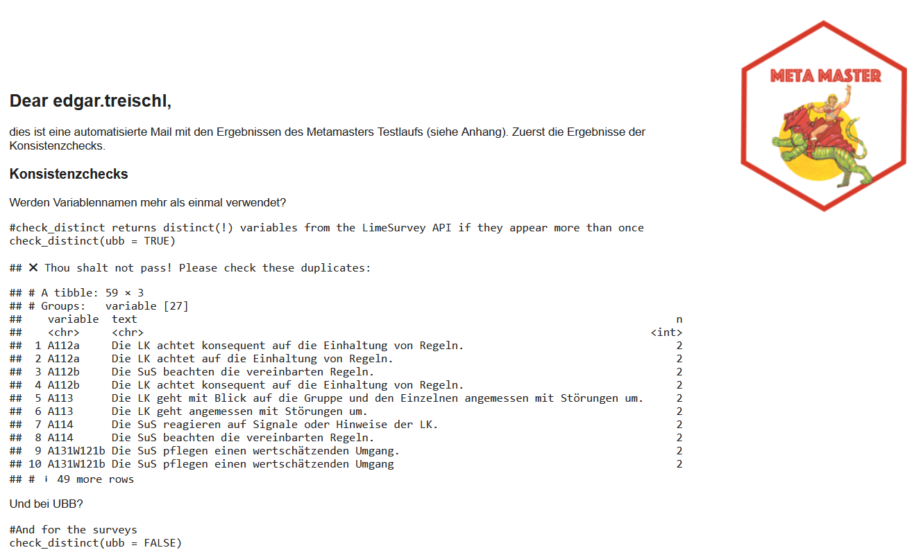

```{r, include = FALSE}
knitr::opts_chunk$set(
  collapse = TRUE,
  comment = "#>"
)
```

The MetaMaster package creates the *master meta data*. The latter are meta data for Lime Survey which are reproducible, tested, and - in consequence - error-free. To this end, the package provides functions to exchange data via the Lime Survey API (`LS_*`) and functions to work with a PostgreSQL (`DB_*`) database. Furthermore, the package introduces consistency checks and further helpers to automate the process to build meta data for Lime Survey.

In order to use the package, you must provide credentials and other parameters to get access to the Lime Survey API (e.g., user name). The MetaMaster packages relies on the `conig` packages to get access to these parameters [@config]. All necessary parameters need to be available in the `config.yml` file within the working directory. The next console shows an example.

``` yaml
default:
  tmp.server: "Name"
  api_url: "URL"
  tmp.user: "user"
  tmp.credential: "Password"
  
test:
  tmp.server: "Name"
  api_url: "URL"
  tmp.user: "user"
  tmp.credential: "Password"
```

In case there is no config file yet, create a new one with the `create_config()` function which has all default parameters included. Furthermore, the config package picks the default parameters without any adjustments. To use the configuration for a different environment (e.g., `test`), set the environmental variable `R_CONFIG_ACTIVE` accordingly. The master templates for the OES live in the `test` environment which is why we have to set it to build the meta data.

```{r}
#Set the R_CONFIG_ACTIVE
library(MetaMaster)
Sys.setenv(R_CONFIG_ACTIVE = "test")
```

 

## MetaMaster in Action

In order to build the meta data, the following steps are necessary. (1) We need to download the raw meta data via the Lime Survey API. (2) We need to build the Master Meta Data based on the raw data. (3) We need to run consistency checks and may inspect the results in an email report. (4) We need to upload all tables of the Master Meta data to the database. The `build()` function runs the first three these steps in sequence:

```{r, eval=FALSE}
build(send_report = TRUE)

# ℹ Starting the build process...
# ℹ Fetching raw meta data from Lime Survey
# ✔ Raw meta data exported.                         
# ℹ Building metadata for the master data...
# ✔ MetaMaster exported.                                              
# ℹ Sending the report...
#   The email message was sent successfully.                            
# ✔ By the power of Grayskull: Building process completed.
```

If the Meta Master was built and all checks were passed, the last step is to update the database. The `DB_MetaUpdate()` splits the sheets of the Master Meta data and replaces the database with the new tables. The following console shows the steps of the `build()` process in action and the next section outlines what happens under the hood.

```{r}
#Build the Meta Master Data
build
```


## MetaMaster Under the Hood

The `LS_GetMasterData()` function creates the raw meta data. The function gets all master templates from the LimeSurvey API and retrieves for each master the survey question, id, so on. The function returns a tibble or exports the data if the `export` parameter is set to `TRUE`.

```{r, eval=FALSE}
#Get the survey questions for the first three master templates
LS_GetMasterData(export = TRUE)
# ✔ Master Data exported.  
```

The `LS_GetMasterData()` is a wrapper function that combines the `LS_GetMasterTemplates()` and the `LS_GetMasterQuestions()` function. Under the hood, the `LS_GetMasterTemplates()` function gets all master templates from the Lime Survey API first. The function returns a tibble with the survey id, the survey title, and the template name (from the master to template file).

```{r, eval=FALSE}
LS_GetMasterTemplates(template = TRUE)
# # A tibble: 95 × 3
#    sid    surveyls_title                       template                       
#    <chr>  <chr>                                <chr>                          
#  1 197865 master_01_bfr_allg_gm_elt_00_2022_v4 tmpl_bfr_allg_gm_elt_00_2022_p1
#  2 197865 master_01_bfr_allg_gm_elt_00_2022_v4 tmpl_bfr_allg_gm_elt_00_2022_p3
#  3 197865 master_01_bfr_allg_gm_elt_00_2022_v4 tmpl_bfr_allg_rs_elt_00_2022_p1
#  4 197865 master_01_bfr_allg_gm_elt_00_2022_v4 tmpl_bfr_beru_ws_elt_00_2022_p1
#  5 943467 master_02_bfr_allg_gm_elt_01_2022_v4 tmpl_bfr_allg_gm_elt_01_2022_p2
#  6 943467 master_02_bfr_allg_gm_elt_01_2022_v4 tmpl_bfr_allg_gm_elt_01_2022_p4
#  7 866667 master_03_bfr_allg_gm_leh_00_2022_v4 tmpl_bfr_allg_gm_leh_00_2022_p1
#  8 866667 master_03_bfr_allg_gm_leh_00_2022_v4 tmpl_bfr_allg_gm_leh_00_2022_p2
#  9 866667 master_03_bfr_allg_gm_leh_00_2022_v4 tmpl_bfr_allg_gm_leh_00_2022_p3
# 10 866667 master_03_bfr_allg_gm_leh_00_2022_v4 tmpl_bfr_allg_gm_leh_00_2022_p4
# # ℹ 85 more rows
# # ℹ Use `print(n = ...)` to see more rows
```

The `LS_GetMasterQuestions()` function gets the survey questions for a specific master template. The function needs the survey id and the template name as input. The function returns a tibble with the survey id, the template name, the plot, the variable, the text, and the filter indicator.

```{r, eval=FALSE}
LS_GetMasterQuestions(id = "197865", name = "master_01_bfr_allg_gm_elt_00_2022_v4")

# # A tibble: 29 × 6
#    surveyID template                             plot  variable      text              filter
#    <chr>    <chr>                                <chr> <chr>         <chr>             <chr> 
#  1 197865   master_01_bfr_allg_gm_elt_00_2022_v4 E01   B131W124EB13a An dieser Schule… FALSE 
#  2 197865   master_01_bfr_allg_gm_elt_00_2022_v4 E01   B132aB13a     Mein Sohn/meine … FALSE 
#  3 197865   master_01_bfr_allg_gm_elt_00_2022_v4 E01   B132cB13a     Die Räume der Sc… FALSE 
#  4 197865   master_01_bfr_allg_gm_elt_00_2022_v4 E01   B133bB13a     Die Schule ist e… FALSE 
#  5 197865   master_01_bfr_allg_gm_elt_00_2022_v4 E02   B334W125aB33a An dieser Schule… FALSE 
#  6 197865   master_01_bfr_allg_gm_elt_00_2022_v4 E02   B334W125bB33a Wenn es Konflikt… FALSE 
#  7 197865   master_01_bfr_allg_gm_elt_00_2022_v4 E02   B333B33a      Mein Sohn/meine … FALSE 
#  8 197865   master_01_bfr_allg_gm_elt_00_2022_v4 E03   A632eA063     Mein Sohn/meine … FALSE 
#  9 197865   master_01_bfr_allg_gm_elt_00_2022_v4 E03   A633eA063     Mein Sohn/meine … FALSE 
# 10 197865   master_01_bfr_allg_gm_elt_00_2022_v4 E03   A631A063      Mein Sohn/meine … FALSE 
# # ℹ 19 more rows
# # ℹ Use `print(n = ...)` to see more rows
```


The `prepare_RawMeta()` function convert the raw data into the Master Meta data. Based on the raw data, we build the two most important tables of the meta data. The templates table contains information about the report template that will be used for the report. And the report table contains information about the variables, plost, and the labels for each report template.


In addition, the meta data contains information abouts sets, colors, and further smaller tables which will not(!) be generated automatically. Let's revise them with the `DB_Table()` function, which grabs a table from the data base. The sets table contains information about the (color) sets, the labels, and so on.

```{r, eval=FALSE}
sets <- DB_Table("sets")
sets
# # A tibble: 54 × 7
#    set   code  labels               sort  colors  text_color timestamp          
#    <chr> <chr> <chr>                <chr> <chr>   <chr>      <dttm>             
#  1 set01 1     stimmt gar nicht     1     #7b3294 white      2024-11-07 14:32:34
#  2 set01 2     stimmt eher nicht    2     #c2a5cf black      2024-11-07 14:32:34
#  3 set01 3     stimmt zum Teil      3     #f7f7f7 black      2024-11-07 14:32:34
#  4 set01 4     stimmt eher          4     #a6dba0 black      2024-11-07 14:32:34
#  5 set01 5     stimmt ganz genau    5     #008837 white      2024-11-07 14:32:34
#  6 set01 6     weiß nicht           6     #d0cece black      2024-11-07 14:32:34
#  7 set03 1     gar nicht zufrieden  1     #7b3294 white      2024-11-07 14:32:34
#  8 set03 2     eher nicht zufrieden 2     #c2a5cf black      2024-11-07 14:32:34
#  9 set03 3     eher zufrieden       3     #a6dba0 black      2024-11-07 14:32:34
# 10 set03 4     sehr zufrieden       4     #008837 white      2024-11-07 14:32:34
# # ℹ 44 more rows
```

The plots_headers table contains information about plot name and the header(s) that will show up in the report.

```{r, eval=TRUE}
plots_headers <- DB_Table("plots_headers")
plots_headers
#> # A tibble: 112 × 5
#>     sort plot  header1                               header2 timestamp          
#>    <dbl> <chr> <chr>                                 <chr>   <dttm>             
#>  1     1 A11   A1 Klassenführung                     A1.1 D… 2024-11-07 14:32:35
#>  2     2 A12   A1 Klassenführung                     A1.2 D… 2024-11-07 14:32:35
#>  3     3 A13   A1 Klassenführung                     A1.3 D… 2024-11-07 14:32:35
#>  4     4 A21   A2 Nachvollziehbarkeit des Lernangeb… A2.1 D… 2024-11-07 14:32:35
#>  5     5 A22   A2 Nachvollziehbarkeit des Lernangeb… A2.2 D… 2024-11-07 14:32:35
#>  6     6 A32   A3 Variation der Lehr- und Lernmetho… A3.2 D… 2024-11-07 14:32:35
#>  7     7 A41   A4  Schülerorientierung               A4.1 B… 2024-11-07 14:32:35
#>  8     8 A42   A4 Schülerorientierung                A4.2 A… 2024-11-07 14:32:35
#>  9     9 A43   A4 Schülerorientierung                A4.3 D… 2024-11-07 14:32:35
#> 10    10 A51   A5 Berücksichtigung unterschiedliche… A5.1 D… 2024-11-07 14:32:35
#> # ℹ 102 more rows
```

These tables are small and there is no need to create them automatically, but this not mean that errors in these tables will not affect the reporting. The MetaMaster comes with several `check_*` function for this case. The `check_manualmeta()` function checks this data before these tables can be updated on the data base.

```{r, eval=FALSE}
check_manualmeta()
```

In a similar sense, we run consistency check for the Meta Master data and the `build()` function includes the `LS_survey_checks*` functions. More precisely, the functions are included in the email template and run automatically if you set the `send_report` parameter to `TRUE`. The next image shows a preview of the email.

{width="95%"}

Under the hood, the blastula package is used to create the email [@blastula]. The email shows the results of the consistency checks and includes the MetaMaster data as an attachment. The email is sent to the email address that is set in the `config.yml` file if you provide the mail crendentials in the working.


Don't forget that the last step is to update the database, which is included in the `build()` function by purpose since it will replace all tables of the master data. The `DB_MetaUpdate()` splits all sheets of the Master Meta data and replaces the database with he new tables. 


## Further Helpers

The MetaMaster contains further helper functions to work with the Lime Survey API.

### Sent

The `LS_SendSurvey()` function sends a survey template to Lime Survey. The function needs the path to the survey template and the name of the survey template. It expects the survey template to be in the LimeSurvey LSS format.

```{r, eval=FALSE}
LS_SendSurvey(lss = "limesurveyMod.lss", 
              name = "mastertemplate")
```

The `LS_SendSurveys()` function is a wrapper around `LS_SendSurvey()`. It sends all survey templates in the working directory to Lime Survey.

```{r, eval=FALSE}
LS_SendSurveys()
```

### Delete

The `LS_DeleteSurvey()` function deletes a survey from LimeSurvey. The function needs the survey ID of the survey template. Be careful, there is no way to restore a deleted survey.

```{r, eval=FALSE}
LS_DeleteSurvey(sid = "123456")
```

### Create Test Scenarios

The `create_TestSchools()` function creates test scenarios for the MetaMaster. The function creates for each master template a test school. The function returns a tibble with the survey id, the survey title, the template name, the school, the new name, the snr, and the test school.

```{r, eval=FALSE}
create_TestSchools()
# # A tibble: 38 × 8
#       sid surveyls_title                   template file  school new_name snr   test_school
#     <int> <chr>                            <chr>    <chr> <chr>  <chr>    <chr> <chr>      
#  1 197865 master_01_bfr_allg_gm_elt_00_20… tmpl_bf… NA    gm     bfr_all… 8934  8934_20242…
#  2 943467 master_02_bfr_allg_gm_elt_01_20… tmpl_bf… NA    gm     bfr_all… 8934  8934_20242…
#  3 866667 master_03_bfr_allg_gm_leh_00_20… tmpl_bf… NA    gm     bfr_all… 8934  8934_20242…
#  4 383484 master_04_bfr_allg_gs_elt_00_20… tmpl_bf… NA    gs     bfr_all… 1208  1208_20242…
#  5 687118 master_05_bfr_allg_gs_elt_01_20… tmpl_bf… NA    gs     bfr_all… 1208  1208_20242…
#  6 661758 master_06_bfr_allg_gs_leh_00_20… tmpl_bf… NA    gs     bfr_all… 1208  1208_20242…
#  7 386673 master_07_bfr_allg_gs_sus_00_20… tmpl_bf… NA    zspf_… bfr_zsp… 6009  6009_20242…
#  8 956526 master_08_bfr_allg_gs_sus_02_20… tmpl_bf… NA    zspf_… bfr_zsp… 6009  6009_20242…
#  9 533711 master_09_bfr_allg_gy_elt_00_20… tmpl_bf… NA    beru_… bfr_ber… 0850  0850_20242…
# 10 197211 master_10_bfr_allg_gy_elt_01_20… tmpl_bf… NA    gy     bfr_all… 0001  0001_20242…
```


## References
